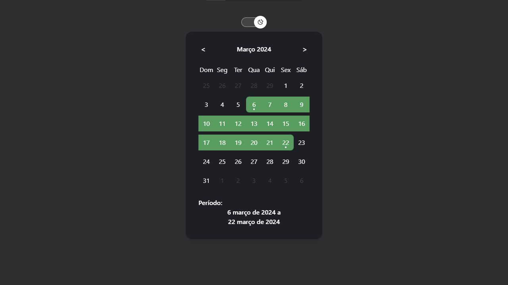
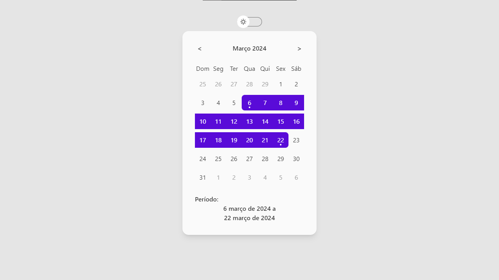
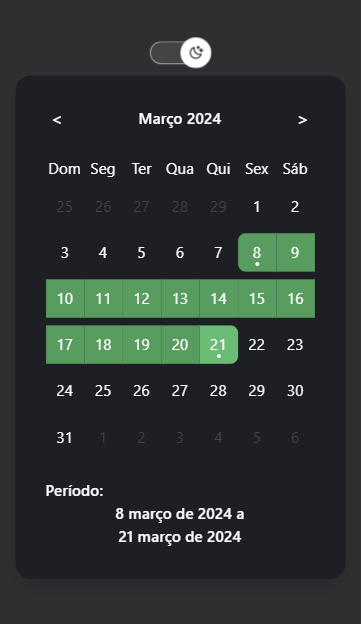
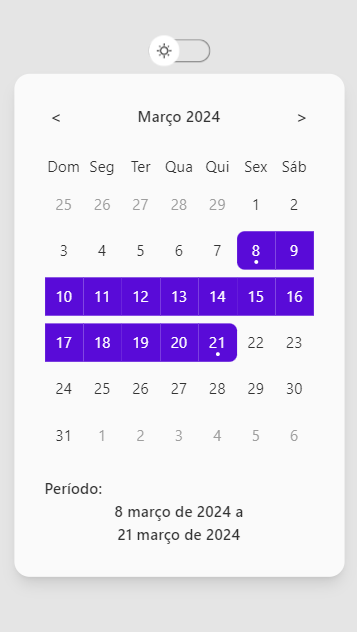
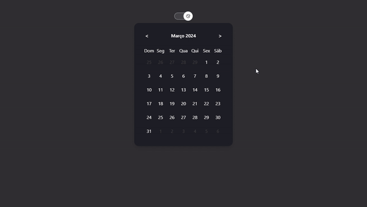

## 📌 Sobre

**DatePicker** foi um projeto realizado para aprendizado, onde não foi utilizado nenhuma lib para gerenciamento do calendário ou da seleção das datas.

## 🚀 Tecnologias utilizadas

O projeto foi desenvolvido utilizando as seguintes tecnologias:

- [Vite](https://vitejs.dev/)
- [Tailwindcss](https://tailwindcss.com/)
- [Typescript](https://www.typescriptlang.org/)
  
## 📆  Exemplo

## ✏ Para iniciar o projeto basta utilizar os seguintes comandos

- Clonar o repositório

    <pre><code>git clone https://github.com/CaioMMendes/DatePicker</code></pre>

- Abrir a pasta no VsCode

- Executar o projeto
    <pre><code>npm i</code></pre>
    <pre><code>npm run dev </code></pre>

## 💻 O projeto pode ser vizualizado acessando o seguinte link

<https://date-picker-three.vercel.app/>

## 👀 Exemplo

